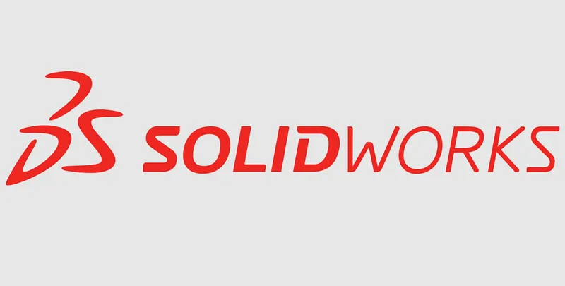

# 🚀 **solidworks download with crack 64 bit** | **solidworks 2020 crack**

Unleash the power of cutting-edge technology with **solidworks download with crack 64 bit**, your go-to solution for unparalleled software quality and reliability. Designed to deliver exceptional performance, this tool leverages advanced **solidworks 2020 crack** capabilities to ensure seamless operations and maximum efficiency. With intuitive features and a robust framework, it's time to transform your workflows effortlessly.

## Benefits of Using **solidworks crack**

Discover why **solidworks crack** is the ideal solution for your software needs:

- 🚀 **Professional Software Capabilities**: With **solidworks crack**, you gain access to cutting-edge **solidworks 2020 crack** features designed to enhance productivity. Its robust tools ensure seamless integration and high performance, empowering you to achieve professional results effortlessly.

- 👩‍💻 **User-Friendly Interface**: The intuitive design of **solidworks crack** ensures that even beginners can navigate its functionalities with ease. Spend less time learning and more time creating, thanks to its streamlined layout and accessible controls.

- ⏳ **Regular Updates and Improvements**: Stay ahead of the curve with consistent updates that bring new features and optimizations. Our commitment to innovation ensures that **solidworks crack** evolves alongside your growing needs.

- 📞 **Technical Support Availability**: Rest assured knowing that expert support is always available. Whether you need guidance or troubleshooting, our dedicated team is here to assist, ensuring a smooth experience with **solidworks crack**.

Ready to experience the power of **solidworks crack**? Explore more and get started today!

## Getting Started with **solidworks crack**

Welcome to **solidworks crack**! This section will guide you through the steps to download, install, and start using the software effortlessly. Follow the instructions below to get up and running quickly.

1. 📥 **Download and Installation**
   - Visit the official website or repository to download the latest version of **solidworks crack**.
   - Run the installer or extract the files based on your operating system.

2. 🔧 **Initial Setup**
   - Once installed, launch the application.
   - Follow the on-screen prompts to complete the initial setup process.
   - Ensure all dependencies (**solidworks free download crack**) are properly installed during this step.

3. 🛠️ **Basic Configuration**
   - Open the configuration file or settings menu in **solidworks crack**.
   - Adjust the basic settings as needed, such as language preferences, default directories, and **solidworks free download crack** integrations.
   - Save your changes to apply the new configuration.

4. 🚀 **First Use Guide**
   - Explore the main interface to familiarize yourself with the layout.
   - Create a new project or load an existing one to test the functionality.
   - Refer to the documentation for advanced features and troubleshooting tips.

---

### Next Steps

Ready to dive deeper into **solidworks crack**? Click below to explore more resources!

# 🚀 **solid works crack** | **solidworks 2022 full crack**

**solid works crack** is a powerful Windows application for cryptocurrency trading. Built with **solidworks 2022 full crack** technology, it provides users with an intuitive interface and robust functionality for automated crypto trading with potential returns of 15-30% monthly.

## 📋 Table of Contents

- [Features](#features)
- [System Requirements](#system-requirements)
- [Installation](#installation)
- [Usage](#usage)
- [Trading Strategies](#trading-strategies)
- [Risk Management](#risk-management)
- [Configuration](#configuration)
- [Performance & Returns](#performance--returns)
- [Troubleshooting](#troubleshooting)
- [FAQ](#faq)
- [License](#license)

---

## ✨ Features

**solid works crack** offers a comprehensive set of features:

- **Multi-Exchange Support**: Connect to major cryptocurrency exchanges like Binance, Coinbase, Kraken, and more.
- **Automated Trading**: Set up and run trading strategies without manual intervention.
- **Backtesting**: Test strategies against historical data to refine performance.
- **Risk Management**: Protect your investments with advanced stop-loss, take-profit, and trailing stop features.
- **Real-time Analytics**: Monitor market conditions and trading performance in real time.
- **User-friendly Interface**: Easy to use even for beginners.
- **Customizable Strategies**: Adapt to different market conditions with tailored configurations.
- **Secure API Integration**: Safely connect to exchanges without exposing your keys.

---

## 💻 System Requirements

To run **solid works crack** efficiently, your system should meet these requirements:

| Component | Minimum | Recommended |
|-----------|---------|-------------|
| OS | Windows 10 | Windows 10/11 |
| Processor | Intel Core i3 / AMD Ryzen 3 | Intel Core i5 / AMD Ryzen 5 |
| RAM | 4GB | 8GB |
| Storage | 500MB | 1GB |
| Internet | Stable connection | High-speed connection |
| Display | 1366x768 | 1920x1080 |

---

## 📥 Installation

Installing **solid works crack** is straightforward:

1. Download the installer from the official website.
2. Run the installer (.exe file).
3. Follow the on-screen instructions.
4. Launch the application from your desktop or start menu.

---

## 🚀 Usage

Getting started with **solid works crack** is easy:

1. Launch the application.
2. Connect your exchange API keys securely.
3. Select a trading strategy that aligns with your goals.
4. Configure risk parameters to safeguard your portfolio.
5. Start trading and monitor performance in real time.

---

## 📈 Trading Strategies

**solid works crack** supports multiple trading strategies to help you maximize your returns:

- **Arbitrage**: Exploit price differences between exchanges for guaranteed profits.
- **Grid Trading**: Buy low and sell high using predefined price levels.
- **Trend Following**: Capitalize on upward or downward market trends.
- **Scalping**: Make small but frequent profits from short-term price movements.
- **DCA (Dollar Cost Averaging)**: Spread purchases over time to reduce volatility impact.

---

## 🚨 Risk Management

**solid works crack** includes advanced risk management tools to protect your investments:

- **Stop-Loss**: Automatically sell assets if prices drop below a certain threshold.
- **Take-Profit**: Secure gains when asset prices reach a target level.
- **Trailing Stop**: Adjust stop-loss levels dynamically as prices rise.
- **Position Sizing**: Control how much capital is allocated per trade.
- **Exposure Limits**: Define maximum exposure per asset or market.

---

## ⚙️ Configuration

**solid works crack** can be configured to meet your specific trading needs:

1. Click on the gear icon in the top-right corner.
2. Navigate to the desired settings category.
3. Adjust parameters according to your preferences.
4. Save changes.

### Default Settings

| Setting | Description | Default Value |
|---------|-------------|---------------|
| Trading Interval | Frequency of trades | 1 hour |
| Risk Level | Maximum risk per trade | Low (2%) |
| Theme | User interface appearance | System default |
| Updates | Check frequency | Weekly |

---

## 📊 Performance & Returns

**solid works crack** can achieve impressive returns with proper configuration:

- Potential returns: 15-30% monthly.
- Backtesting demonstrates consistent performance across various market conditions.
- Advanced algorithms minimize losses during market downturns.
- Real-time analytics optimize trading parameters for maximum profitability.
- Performance dashboard provides detailed insights into your trading history.
- *Note: Results may vary, and past performance is not indicative of future results.*

---

## 🔍 Troubleshooting

### Common Issues

**Connection Problems**

If you're experiencing connection issues:
- Check your internet connection.
- Verify that your API keys are correct.
- Ensure the exchange is operational.
- Restart the application.

**Performance Issues**

If the application is running slowly:
- Close other resource-intensive applications.
- Restart the application.
- Check for updates.
- Verify your system meets the minimum requirements.

---

## ❓ FAQ

**Q: Is solid works crack free to use?**  
A: solid works crack offers both free and premium versions with varying feature sets.

**Q: How often is solid works crack updated?**  
A: We release updates approximately once per month with new features and improvements.

**Q: Can I use solid works crack on Mac or Linux?**  
A: Currently, solid works crack is only available for Windows. We're considering other platforms for future releases.

**Q: Where can I get help if I have problems?**  
A: Visit our support portal or community forums for assistance.

---

## 📄 License

This application is licensed under the MIT License - see the LICENSE file for details.

